# Voice Assistant (Go + sherpa-onnx)

A real-time voice assistant that runs entirely locally implemented in Go using [sherpa-onnx](https://github.com/k2-fsa/sherpa-onnx) for speech recognition and synthesis.

This is my first foray into the world of AI-powered voice assistants. As a fan of hyper-efficient code and with edge devices in mind, I’m avoiding Python and instead building the assistant in Go for learning purposes and to gain experience developing applications with CoreML and CUDA support.

For the LLM processing, I'm relying on [Ollama](https://ollama.com/), as it works perfectly for this use case, even though I'm just scratching the surface of what I can do with it.

## Features

- **Voice Activity Detection (VAD)**: Silero-VAD for accurate speech boundary detection
- **Speech-to-Text (STT)**: Whisper multilingual model for high-quality transcription (99 languages)
- **Text-to-Speech (TTS)**: Kokoro for natural-sounding voice synthesis with emotional expression
- **LLM Integration**: Ollama API for conversational AI
- **Low Latency**: Optimized for real-time conversation
- **Interrupt Support**: Optional stop playback when user starts speaking
- **Wake Word**: Optional wake word activation
- **Hardware Acceleration**: Auto-detected CoreML (macOS) and CUDA (Linux)
- **Multilingual**: Both STT and TTS support multiple languages (English, Spanish, French, German, etc.)
- **Shared Assets**: Models stored in `~/.voice-assistant`

## Cross-Platform Support

This implementation supports multiple platforms with hardware acceleration:

| Platform | STT Provider | TTS Provider | Notes |
|----------|--------------|--------------|-------|
| macOS (Intel) | `coreml` | `coreml` | Full CoreML acceleration |
| macOS (Apple Silicon) | `coreml` | `coreml` | ANE for STT and TTS |
| Linux (NVIDIA GPU) | `cuda` | `cuda` | Full GPU acceleration |
| Linux (Jetson SOC) | `cuda` | `cuda` | Jetson GPU (Nano, Orin, Xavier) |
| Linux (CPU only) | `cpu` | `cpu` | CPU multi-threading |

Providers are **auto-detected** at runtime based on your platform. Kokoro TTS supports full CoreML acceleration on macOS and CUDA on Linux.

You can override providers with `--provider` (for STT) and `--tts-provider` flags.

## Tested Hardware

This solution has been designed and tested on the following platforms:

| Device | CPU | Memory | Audio Device | Notes |
|--------|-----|--------|--------------|-------|
| **Apple Mac Mini M4** | Apple M4 (10-core) | 16GB unified | AirPods Pro | Full CoreML acceleration (ANE) |
| **NVIDIA Jetson Orin Nano Super** | ARM Cortex-A78AE | 8GB unified | AirPods Pro | Full CUDA acceleration |

### Minimum Hardware Requirements

- **Memory**: 8GB minimum (unified memory recommended)
- **Storage**: ~2GB for models
- **Audio**: Bluetooth audio devices (tested with AirPods Pro) or USB/built-in microphone and speakers
- **GPU/Accelerator**: Apple Silicon (M1/M2/M3/M4) with ANE, or NVIDIA GPU with CUDA support

## Architecture

```mermaid
flowchart LR
    subgraph Pipeline
        A[🎤 Audio Capture<br/>malgo] --> B[🗣️ VAD + STT<br/>Whisper]
        B --> C[🧠 LLM<br/>Ollama]
        C --> D[📢 TTS<br/>Kokoro]
        D --> E[🔊 Playback<br/>malgo]
    end
    
    E -.->|Interrupt Flag<br/>speech detected| A
```



## Prerequisites

- Go 1.25 or later
- CGO enabled (`CGO_ENABLED=1`)
- [Ollama](https://ollama.ai/) running locally with a model loaded

### Platform-Specific Requirements

**macOS:**
- Xcode Command Line Tools: `xcode-select --install`
- CoreML is automatically available on macOS 10.13+

**Linux (CPU):**
- ALSA development libraries: `sudo apt install libasound2-dev`

**Linux (NVIDIA CUDA):**
- ALSA development libraries: `sudo apt install libasound2-dev`
- NVIDIA GPU with CUDA support
- NVIDIA Driver 450.80.02+ 
- CUDA Toolkit 11.0+: `sudo apt install nvidia-cuda-toolkit`
- cuDNN 8.0+ (optional, for optimal performance)

To verify CUDA is available:
```bash
nvidia-smi  # Should show your GPU
nvcc --version  # Should show CUDA version
```

## Installation

### 1. Download Models

Run the setup script to download required models (~500MB total):

```bash
chmod +x scripts/setup.sh
./scripts/setup.sh
```

This downloads:
- **Silero-VAD**: Voice activity detection model
- **Whisper small**: Multilingual speech recognition model (int8 quantized, 99 languages)
- **Kokoro v1.0**: Multilingual text-to-speech model with natural voices

**Setup Script Options:**
```bash
# Custom installation directory
./scripts/setup.sh --assets-dir /custom/path

# Force re-download even if files exist
./scripts/setup.sh --force

# Combine options
./scripts/setup.sh --assets-dir /custom/path --force
```

The setup script is **idempotent** - it won't re-download existing files unless `--force` is used.

### 2. Build the Application

```bash
./scripts/build.sh
```

Or manually:

```bash
CGO_ENABLED=1 go build -o voice-assistant ./cmd/assistant
```

The build automatically selects the correct platform-specific sherpa-onnx bindings:
- macOS: Uses `sherpa-onnx-go-macos` with CoreML support
- Linux: Uses `sherpa-onnx-go-linux` (CPU-only by default)

#### Building with CUDA Support (Linux)

The default `sherpa-onnx-go-linux` package includes **CPU-only** binaries. For true CUDA/GPU acceleration on NVIDIA hardware (including Jetson devices), you need to build sherpa-onnx from source with CUDA enabled.

The build script handles this automatically:

```bash
# Auto-detect: builds with CUDA if GPU and CUDA toolkit are found
./scripts/build.sh

# Force CUDA build (requires CUDA toolkit)
./scripts/build.sh --cuda

# Force CPU-only build (skip CUDA even if available)
./scripts/build.sh --cpu
```

**CUDA Build Requirements:**
- NVIDIA GPU (discrete or Jetson SOC)
- CUDA Toolkit (or JetPack for Jetson)
- CMake 3.13+
- Git
- C++ compiler (gcc/g++)

The build script will:
1. Clone sherpa-onnx source (once)
2. Build with `-DSHERPA_ONNX_ENABLE_GPU=ON`
3. Install to `.sherpa-onnx-cuda/` in your project
4. Link your build against the CUDA-enabled libraries

**First build takes ~10-20 minutes** depending on your hardware. Subsequent builds use the cached sherpa-onnx libraries.

**Verify CUDA is working:**
```bash
./run-voice-assistant.sh
# Should show: ⚡ STT acceleration: cuda, TTS acceleration: cuda
# Should NOT show: "Please compile with -DSHERPA_ONNX_ENABLE_GPU=ON" warnings
```

### 3. Start Ollama

Make sure Ollama is running with a model:

```bash
ollama run gemma3:1b
```

### 4. Run the Assistant

**macOS or Linux (CPU):**
```bash
./voice-assistant
```

**Linux with CUDA (recommended):**
```bash
./run-voice-assistant.sh
```

The wrapper script sets up `LD_LIBRARY_PATH` for CUDA libraries automatically.

## Multi-Language Support

Both Whisper (STT) and Kokoro (TTS) support multiple languages. The assistant can understand and respond in Spanish, French, Italian, Portuguese, Japanese, Chinese, and more.

### How It Works

1. **Speech Recognition (STT)**: Set your language with `-stt-language` (e.g., `es` for Spanish)
2. **Text-to-Speech (TTS)**: Voice language is **automatically detected** from the voice name prefix:
   - `ef_*/em_*` → Spanish (`es`)
   - `ff_*` → French (`fr`)
   - `hf_*/hm_*` → Hindi (`hi`)
   - `if_*/im_*` → Italian (`it`)
   - `jf_*/jm_*` → Japanese (`ja`)
   - `pf_*/pm_*` → Portuguese BR (`pt-br`)
   - `af_*/am_*` → American English
   - `bf_*/bm_*` → British English
   - `zf_*/zm_*` → Chinese (Mandarin)

3. **LLM**: Use a multilingual model like `qwen2.5:3b` for proper language matching

### Complete Spanish Example

To use the assistant entirely in Spanish:

```bash
# 1. Pull a multilingual LLM model (one time)
ollama pull qwen2.5:3b

# 2. Run with Spanish speech recognition + Spanish TTS voice
./voice-assistant \
  -ollama-model qwen2.5:3b \
  -stt-language es \
  -tts-voice ef_dora \
  -tts-speaker-id 28
```

**What happens:**
- You speak in Spanish → Whisper transcribes it
- Qwen2.5 responds in Spanish (it automatically detects the input language)
- Kokoro synthesizes the response with the Spanish female voice (ef_dora)

### Available Languages & Voices

Whisper supports 99 languages. Here are the most common with their Kokoro TTS voices:

| Language | STT Code | TTS Voice Options | Speaker IDs |
|----------|----------|------------------|-------------|
| **Spanish** | `es` | `ef_dora` (female), `em_alex` (male) | 28, 29 |
| **French** | `fr` | `ff_siwis` (female) | 33 |
| **Italian** | `it` | `if_*`, `im_*` voices | varies |
| **Portuguese** | `pt` | `pf_*`, `pm_*` voices | varies |
| **Japanese** | `ja` | `jf_*`, `jm_*` voices | varies |
| **Chinese** | `zh` | `zf_*`, `zm_*` voices | varies |
| **Hindi** | `hi` | `hf_*`, `hm_*` voices | varies |
| **English (US)** | `en` | `af_bella`, `am_michael`, etc. | 2, 16, ... |
| **English (UK)** | `en` | `bf_emma`, `bm_george`, etc. | 21, 26, ... |

For all 53 available voices: `./voice-assistant --list-voices`

### Multilingual LLM Models

The default `gemma3:1b` model has limited multilingual support. Use these instead:

| Model | Size | Languages | Best For |
|-------|------|-----------|----------|
| **qwen2.5:3b** ⭐ | ~2GB | Excellent for 15+ languages | Recommended |
| **qwen2.5:1.5b** | ~1GB | Good for 15+ languages | Faster, smaller |
| **aya-expanse:8b** | ~4.9GB | Purpose-built for 23+ languages | Best quality |
| **gemma2:2b** | ~1.6GB | Better than gemma3:1b | Alternative |

### More Examples

```bash
# French (automatic language in response)
./voice-assistant \
  -ollama-model qwen2.5:3b \
  -stt-language fr \
  -tts-voice ff_siwis \
  -tts-speaker-id 33

# Auto-detect input language (English, Spanish, French, etc.)
./voice-assistant \
  -ollama-model qwen2.5:3b \
  -stt-language auto \
  -tts-voice af_bella \
  -tts-speaker-id 2

# Japanese
./voice-assistant \
  -ollama-model qwen2.5:3b \
  -stt-language ja \
  -tts-voice jf_* \
  -tts-speaker-id <id>
```

**Note**: Qwen models automatically respond in the same language as your input without needing to modify the system prompt.

### Examples

**Basic usage (always listening):**
```bash
# macOS or Linux CPU
./voice-assistant

# Linux with CUDA
./run-voice-assistant.sh
```

**With wake word:**
```bash
./run-voice-assistant.sh -wake-word "hey assistant"
```

**Custom Ollama model:**
```bash
./voice-assistant -ollama-model "mistral:7b"
```

**Faster speech:**
```bash
./voice-assistant -tts-speed 1.2
```

**Verbose mode for debugging:**
```bash
./voice-assistant -verbose
```

**Force CPU-only inference (disable GPU):**
```bash
./voice-assistant -provider cpu
```

**Force CUDA on Linux (if auto-detect fails):**
```bash
./run-voice-assistant.sh -provider cuda
```

## Interrupt Mode: Handling Acoustic Feedback

The assistant supports two modes for managing playback interruption when speech is detected:

### Understanding the Problem

When using **headsets** (headphones + microphone), the system works perfectly: the microphone only captures your voice, so interrupting playback when you speak is straightforward.

However, with **open mic/speaker setups** (external speakers + separate microphone), the assistant's own voice output can be captured by the microphone, causing unwanted self-interruption. This is known as **acoustic feedback** or **acoustic echo**.

### Available Modes

Use the `--interrupt-mode` flag to select the appropriate behavior for your audio setup:

#### `always` Mode (Best for Headsets)
```bash
./voice-assistant -interrupt-mode always
```

- **Use when**: Using headphones or headset
- **Behavior**: Immediately interrupts playback when speech is detected
- **Advantage**: Natural conversation flow, can interrupt the assistant mid-sentence
- **Limitation**: Will self-interrupt with open speakers (assistant's voice triggers VAD)

#### `wait` Mode (Best for Open Speakers) - **Default**
```bash
./voice-assistant -interrupt-mode wait
```

- **Use when**: Using external speakers with separate microphone
- **Behavior**: Pauses microphone capture during playback, resumes after with configurable delay
- **Advantage**: Prevents acoustic feedback and self-interruption
- **Limitation**: Cannot interrupt assistant mid-sentence, must wait for response to complete
- **Delay**: Use `-post-playback-delay-ms 300` to adjust resume delay (default 300ms)

### Example Usage

```bash
# For headset users (natural interruption)
./voice-assistant -interrupt-mode always

# For open mic/speaker setup (prevent feedback)
./voice-assistant -interrupt-mode wait -post-playback-delay-ms 500

# Optimize audio buffer for wired/built-in audio (lower latency)
./voice-assistant -audio-buffer-ms 20

# Default buffer works best for Bluetooth devices (100ms)
./voice-assistant  # Uses 100ms buffer by default
```

### Audio Buffer Configuration

The audio buffer size affects latency and compatibility with different audio devices:

| Buffer Size | Best For | Latency | Notes |
|-------------|----------|---------|-------|
| **100ms** (default) | Bluetooth devices | Higher | Prevents distortion with AirPods, etc. |
| **20ms** | Wired/USB/Built-in | Low | More responsive, real-time feel |
| **50ms** | Mixed use | Medium | Balance between latency and stability |

**Usage:**
```bash
# For Bluetooth devices (default, recommended for AirPods)
./voice-assistant

# For wired or built-in audio
./voice-assistant -audio-buffer-ms 20
```

**Why this matters:** Bluetooth audio has inherent latency (100-200ms), so using a small buffer (20ms) can cause audio underruns and distortion. The 100ms default matches Bluetooth's characteristics.

### Technical Background

**Why is this a problem?**
- Voice activity detection (VAD) analyzes audio energy and spectral features
- The assistant's synthesized voice has similar characteristics to human speech
- Without isolation, VAD cannot distinguish between user speech and playback

**Why not use echo cancellation?**
- Acoustic Echo Cancellation (AEC) requires significant computational resources
- Cross-platform AEC libraries have varying quality and platform-specific implementations
- On Linux, system-level solutions (PipeWire, PulseAudio) can provide AEC with proper configuration
- On macOS, Core Audio's VoiceProcessingIO provides AEC but requires platform-specific integration

The `wait` mode provides a simple, reliable solution that works consistently across all platforms without additional computational overhead.

## Adding TTS Voices

Kokoro TTS includes multiple voices in a single model. You can change voices using the `-tts-voice` and `-tts-speaker-id` flags:

### Available Kokoro Voices (English)

**American Voices:**
| Name | Speaker ID | Quality | Description |
|------|-----------|---------|-------------|
| `af_heart` | 3 | A | American female, flagship voice |
| `af_bella` | 2 | A- | American female, high quality (default) |
| `af_nicole` | 6 | B- | American female, good quality |
| `af_sarah` | 9 | C+ | American female, warm |
| `af_sky` | 10 | C- | American female, youthful |
| `am_adam` | 11 | F+ | American male, basic quality |
| `am_michael` | 16 | C+ | American male, medium quality |

**British Voices:**
| Name | Speaker ID | Quality | Description |
|------|-----------|---------|-------------|
| `bf_emma` | 21 | B- | British female, recommended |
| `bf_isabella` | 22 | C | British female, medium quality |
| `bm_george` | 26 | C | British male, medium quality |
| `bm_lewis` | 27 | D+ | British male, basic quality |

For a complete list of all 53 voices (including Spanish, French, Japanese, and more), run:
```bash
./voice-assistant --list-voices
```

### Changing Voices

```bash
# Use British male voice (George)
./voice-assistant -tts-voice bm_george -tts-speaker-id 26

# Use American female voice (Nicole)
./voice-assistant -tts-voice af_nicole -tts-speaker-id 6
```

### Viewing Available Voices

To see all 53 available Kokoro voices with their speaker IDs, quality grades, and descriptions:

```bash
# List all voices
./voice-assistant --list-voices

# Get details for a specific voice
./voice-assistant --voice-info af_bella
```

## Project Structure

```
voice-assistant/
├── cmd/
│   └── assistant/
│       └── main.go           # Main entry point and pipeline orchestration
├── internal/
│   ├── audio/
│   │   ├── capture.go        # Microphone audio capture (malgo)
│   │   └── playback.go       # Audio playback with interrupt support
│   ├── config/
│   │   └── config.go         # CLI flags and configuration
│   ├── llm/
│   │   └── client.go         # Ollama API client
│   ├── sherpa/
│   │   ├── sherpa_darwin.go  # macOS-specific sherpa-onnx bindings (CoreML)
│   │   └── sherpa_linux.go   # Linux-specific sherpa-onnx bindings (CUDA)
│   ├── stt/
│   │   └── recognizer.go     # VAD + Whisper speech recognition
│   └── tts/
│       └── synthesizer.go    # Kokoro text-to-speech
├── scripts/
│   ├── setup.sh              # Model download script
│   └── build.sh              # Build script with CUDA support
├── go.mod
└── README.md
```

## Models

| Component | Model | Size | Purpose |
|-----------|-------|------|---------|
| VAD | Silero-VAD | ~2MB | Speech boundary detection |
| STT | Whisper small (int8) | ~150MB | Speech recognition |
| TTS | Kokoro v1.0 | ~311MB | Expressive voice synthesis |

### Alternative Models

You can use different models by modifying the setup script or providing custom paths:

**STT alternatives:**
- `whisper-tiny.en` - Faster, less accurate
- `whisper-base.en` - Balance of speed/accuracy
- `whisper-medium.en` - Higher accuracy, slower

**TTS voices (Kokoro built-in):**
- `af_bella` (speaker ID 2) - American female, high quality (default)
- `af_heart` (speaker ID 3) - American female, flagship voice
- `bf_emma` (speaker ID 21) - British female, recommended
- `am_adam` (speaker ID 11) - American male

For all 53 voices across 9 languages, run: `./voice-assistant --list-voices`

## Latency Considerations

This implementation uses **OfflineRecognizer** (batch processing) rather than OnlineRecognizer (streaming) because:

1. **VAD pre-segments audio**: The Silero-VAD detects complete utterances before transcription
2. **Whisper accuracy**: Whisper performs best on complete audio segments
3. **Practical latency**: The VAD adds minimal delay (~250ms silence detection), and Whisper processes quickly on modern hardware

For even lower latency, you could:
- Use a streaming model (Zipformer, Paraformer) with OnlineRecognizer
- Reduce VAD silence threshold
- Use smaller Whisper model (tiny.en)

## Hardware Acceleration Details

### CoreML (macOS)

CoreML is Apple's machine learning framework that automatically leverages:
- **Apple Neural Engine (ANE)** on M1/M2/M3/M4 chips for maximum efficiency
- **GPU acceleration** on Intel Macs with discrete graphics
- **CPU fallback** when specialized hardware is unavailable

No additional installation required - CoreML is built into macOS.

### CUDA (Linux)

NVIDIA CUDA enables GPU-accelerated inference on Linux, supporting both discrete GPUs and Jetson SOC devices.

**Supported Hardware:**
- Discrete NVIDIA GPUs (GTX 10xx series or newer)
- NVIDIA Jetson devices (Nano, Orin, Xavier, AGX)

**Requirements for Discrete GPUs:**
- NVIDIA Driver 450.80.02 or later
- CUDA Toolkit 11.0 or later

**Installation (Ubuntu/Debian):**
```bash
# Install NVIDIA driver (if not already installed)
sudo apt install nvidia-driver-535

# Install CUDA toolkit
sudo apt install nvidia-cuda-toolkit

# Verify installation
nvidia-smi
nvcc --version
```

**Jetson Devices:**
Jetson devices (Nano, Orin, Xavier) come with JetPack SDK which includes CUDA support out of the box. The auto-detection will recognize Jetson devices via:
- `/dev/nvhost-gpu` device
- `/etc/nv_tegra_release` file
- Tegra identifiers in device tree

**Important:** The build script automatically selects the correct ONNX Runtime version based on your CUDA version. Different Jetson boards require different versions:

| Jetson Device | JetPack | CUDA Version | ONNX Runtime |
|---------------|---------|--------------|--------------|
| Jetson Nano B01 | 4.x | CUDA 10.2 | 1.11.0 |
| Jetson Orin NX | 5.x | CUDA 11.4 | 1.16.0 |
| Jetson Orin (JetPack 6.x) | 6.x | CUDA 12.2 | 1.18.0 |
| Jetson Orin (JetPack 6.2+) | 6.2+ | CUDA 12.6 | 1.18.1 |

The build script detects your CUDA version automatically and downloads the matching ONNX Runtime.

**Running on Jetson:**
```bash
# Build with CUDA support
./scripts/build.sh --cuda

# Run using the wrapper script (recommended - sets up library paths)
./run-voice-assistant.sh

# Or run directly if paths are configured
./voice-assistant
```

If you see errors like `libcublas.so.X: cannot open shared object file`, it means there's a CUDA version mismatch. The wrapper script sets up `LD_LIBRARY_PATH` to help resolve this.

**Optional: Install cuDNN for optimal performance:**
```bash
# Download cuDNN from NVIDIA (requires account)
# https://developer.nvidia.com/cudnn
sudo dpkg -i cudnn-local-repo-*.deb
sudo apt update
sudo apt install libcudnn8
```

The voice assistant will automatically detect CUDA availability and use GPU acceleration.

## VS Code Development Setup

When developing this cross-platform project in VS Code, gopls (the Go language server) may show errors for platform-specific code that doesn't apply to your current OS. For example, on macOS you might see `[linux,amd64]` errors for Linux-specific imports.

### Recommended VS Code Settings

The project includes a `.vscode/settings.json` file that configures gopls to analyze only for your current platform. **You may need to update the `GOOS` and `GOARCH` values to match your system:**

**macOS (Apple Silicon - M1/M2/M3/M4):**
```json
{
    "gopls": {
        "build.env": {
            "CGO_ENABLED": "1",
            "GOOS": "darwin",
            "GOARCH": "arm64"
        }
    }
}
```

**macOS (Intel):**
```json
{
    "gopls": {
        "build.env": {
            "CGO_ENABLED": "1",
            "GOOS": "darwin",
            "GOARCH": "amd64"
        }
    }
}
```

**Linux (x86_64):**
```json
{
    "gopls": {
        "build.env": {
            "CGO_ENABLED": "1",
            "GOOS": "linux",
            "GOARCH": "amd64"
        }
    }
}
```

**Linux (ARM64 / Jetson):**
```json
{
    "gopls": {
        "build.env": {
            "CGO_ENABLED": "1",
            "GOOS": "linux",
            "GOARCH": "arm64"
        }
    }
}
```

After modifying settings, restart the Go language server:
1. Open Command Palette (`Cmd+Shift+P` on macOS, `Ctrl+Shift+P` on Linux)
2. Run **"Go: Restart Language Server"**

### Why This Is Needed

This project uses Go build constraints (`//go:build darwin` / `//go:build linux`) to provide platform-specific sherpa-onnx bindings. By default, gopls may analyze files for all platforms, causing spurious errors for code that won't run on your current OS. Setting `GOOS` and `GOARCH` tells gopls to analyze only for your platform.

## Upgrading Dependencies

### Version Compatibility Overview

This project uses [sherpa-onnx](https://github.com/k2-fsa/sherpa-onnx) for speech processing. Version management differs by platform:

| Platform | How It Works | Version Check |
|----------|--------------|---------------|
| **macOS** | Uses pre-built `sherpa-onnx-go-macos` bindings | Automatic (handled by bindings) |
| **Linux (CPU)** | Uses pre-built `sherpa-onnx-go-linux` bindings | Automatic (handled by bindings) |
| **Linux (CUDA)** | Compiles sherpa-onnx from source | **Manual sync required** |

### CUDA Build Version Requirements

For Linux CUDA builds, three files must stay in sync:

| File | What to Update | Current Value |
|------|----------------|---------------|
| `go.mod` | `sherpa-onnx-go-linux` and `sherpa-onnx-go-macos` versions | `v1.12.22` |
| `scripts/build.sh` | `SHERPA_VERSION` variable | `v1.12.22` |

The build script includes a **sanity check** that fails with clear instructions if versions mismatch.

### ONNX Runtime Compatibility Matrix

The build script automatically selects the correct ONNX Runtime version based on your CUDA version:

| CUDA Version | ONNX Runtime | Use Case |
|--------------|--------------|----------|
| 10.2.x | 1.11.0 | Jetson Nano (JetPack 4.x) |
| 11.4.x | 1.16.0 | Jetson Orin NX (JetPack 5.x) |
| 11.x | 1.16.0 | Generic CUDA 11 |
| 12.2.x | 1.18.0 | CUDA 12.2 with cuDNN8 |
| 12.6.x+ | 1.18.1 | JetPack 6.2+ (cuDNN9) |
| 12.x | 1.18.1 | Generic CUDA 12 |

### Upgrade Procedure

1. **Check for new releases:**
   - Visit [sherpa-onnx releases](https://github.com/k2-fsa/sherpa-onnx/releases)
   - Visit [sherpa-onnx-go-linux](https://github.com/k2-fsa/sherpa-onnx-go-linux/releases)

2. **Update go.mod:**
   ```bash
   go get github.com/k2-fsa/sherpa-onnx-go-linux@vX.Y.Z
   go get github.com/k2-fsa/sherpa-onnx-go-macos@vX.Y.Z
   go mod tidy
   ```

3. **Update build script:**
   - Edit `scripts/build.sh`
   - Update `SHERPA_VERSION="vX.Y.Z"` to match

4. **Test on macOS (easy path):**
   ```bash
   ./scripts/build.sh
   ./voice-assistant
   ```

5. **Test on Linux with CUDA:**
   ```bash
   ./scripts/build.sh --clean --cuda
   ./run-voice-assistant.sh
   ```
   - Watch for ABI mismatch errors or "Please compile with -DSHERPA_ONNX_ENABLE_GPU=ON" warnings
   - Verify provider shows `cuda` not `cpu`

6. **If CUDA build fails:**
   - Check if the ONNX Runtime version mapping needs updating
   - Review sherpa-onnx release notes for breaking changes
   - The ONNX Runtime mapping in `scripts/build.sh` may need new entries for newer CUDA versions

## Portable Deployment

For CUDA builds on Linux, the runtime libraries are installed to `~/.voice-assistant/go/lib/`. This enables portable deployment:

**On the build machine:**
```bash
./scripts/build.sh --cuda
```

**To deploy to another machine:**
1. Copy the `~/.voice-assistant/go` directory (contains CUDA libraries)
2. Copy the `~/.voice-assistant/models` directory (shared model files)
3. Copy the `voice-assistant` binary
4. Copy the `run-voice-assistant.sh` wrapper script

**On the target machine:**
```bash
# Ensure CUDA toolkit is installed, then run:
./run-voice-assistant.sh
```

The wrapper script automatically sets `LD_LIBRARY_PATH` to find libraries in `~/.voice-assistant/go/lib/`.

**macOS Note:** On macOS with CoreML, the Go binary is statically linked and doesn't require runtime libraries. Just copy the binary and `~/.voice-assistant/models/` directory.

## Troubleshooting

### "Failed to create VAD" or "Failed to create offline recognizer"
- Ensure models are downloaded: `./scripts/setup.sh`
- Check model paths match configuration
- Verify sherpa-onnx is properly installed

### "Cannot reach Ollama"
- Start Ollama: `ollama serve`
- Load a model: `ollama run gemma3:1b`
- Check the host URL matches: `-ollama-host http://localhost:11434`

### No audio capture
- Check microphone permissions (macOS: System Preferences → Privacy → Microphone)
- Verify microphone is connected and working
- Try running with `-verbose` to see audio processing logs

### Build errors with CGO
- Ensure CGO is enabled: `export CGO_ENABLED=1`
- Install required system libraries for your platform

### CUDA errors on Linux
- Verify NVIDIA driver: `nvidia-smi`
- Check CUDA version: `nvcc --version`
- Try forcing CPU mode: `./voice-assistant -provider cpu`
- Ensure CUDA libraries are in `LD_LIBRARY_PATH`

### CoreML errors on macOS
- Ensure macOS 10.13 or later
- Try forcing CPU mode: `./voice-assistant -provider cpu`

## Acknowledgments

This project builds upon the excellent work of many open-source libraries and models:

### Core Libraries & Models

- [sherpa-onnx](https://github.com/k2-fsa/sherpa-onnx) - Speech recognition and synthesis framework (Apache-2.0)
- [Silero VAD](https://github.com/snakers4/silero-vad) - Voice activity detection model (MIT)
- [OpenAI Whisper](https://github.com/openai/whisper) - Multilingual speech recognition model (MIT)
- [Kokoro](https://huggingface.co/hexgrad/Kokoro-82M) - Expressive neural text-to-speech model (MIT/Apache-2.0)
- [Ollama](https://ollama.ai/) - Local LLM inference engine (MIT)

### Go Implementation Dependencies

**Apache-2.0:**
- [sherpa-onnx-go-linux](https://github.com/k2-fsa/sherpa-onnx-go-linux)
- [sherpa-onnx-go-macos](https://github.com/k2-fsa/sherpa-onnx-go-macos)

**Unlicense:**
- [malgo](https://github.com/gen2brain/malgo)

**BSD-3-Clause:**
- Go standard library

### License

This project is licensed under the Apache License 2.0 - see the [LICENSE](LICENSE) file for details.

All dependencies use permissive licenses (MIT, Apache-2.0, BSD-3-Clause, Unlicense) that are compatible with the Apache-2.0 License.
