# Voice Assistant (Rust Implementation)

A real-time voice assistant that runs entirely locally implemented in Rust based on [sherpa-rs](https://github.com/thewh1teagle/sherpa-rs), using speech recognition, local LLMs, and text-to-speech synthesis.

## Features

- **Speech-to-Text**: Whisper-based multilingual speech recognition via sherpa-onnx (99 languages)
- **Voice Activity Detection**: Silero VAD for detecting when you're speaking
- **Local LLM**: Ollama integration via RIG for conversational AI
- **Text-to-Speech**: Kokoro multilingual voices for natural, expressive speech synthesis
- **Cross-Platform**: Runs on macOS and Linux with hardware acceleration support
- **Low Latency**: Streaming TTS and interrupt support for responsive interaction
- **Multilingual**: Both STT and TTS support multiple languages (English, Spanish, French, German, etc.)
- **Live Translation**: Zero-code configuration for real-time language translation (see [main README](../README.md#live-translation-use-case))
- **Configurable Temperature**: Adjustable LLM temperature for translation vs. conversational tasks
- **Shared Assets**: Models stored in `~/.voice-assistant` are shared with the Go implementation

## Architecture

```mermaid
flowchart LR
   subgraph Voice Assistant
      Mic[🎤 Mic] --> Capture[Audio Capture]
      Capture --> VAD[VAD + STT<br/>Whisper]
      VAD --> LLM[LLM<br/>Ollama]
      LLM --> TTS[TTS<br/>Kokoro]
      TTS --> Speaker[🔊 Speaker]
      TTS -.->|Interrupt on Speech| Capture
   end
```



## Requirements

For tested hardware platforms and minimum requirements, see the [main README](../README.md#tested-hardware).

### Software Requirements

- **Rust**: 1.92+ (install via [rustup](https://rustup.rs))
- **Ollama**: For local LLM inference ([install](https://ollama.ai))

### Linux Dependencies

```bash
# Debian/Ubuntu
sudo apt install libasound2-dev

# Fedora
sudo dnf install alsa-lib-devel
```

## Quick Start

### 1. Clone and Setup

```bash
cd rust-impl

# Download required models (to ~/.voice-assistant/models by default)
# Both Go and Rust implementations use the exact same model files
./scripts/setup.sh

# Custom installation directory
./scripts/setup.sh --assets-dir /custom/path

# Force re-download even if files exist
./scripts/setup.sh --force
```

The setup script is **idempotent** - it won't re-download existing files unless `--force` is used.

### 2. Install Ollama and Model

```bash
# Install Ollama (if not already installed)
curl -fsSL https://ollama.ai/install.sh | sh

# Pull the default model
ollama pull gemma3:1b
```

### 3. Build and Run

**macOS or Linux (CPU):**
```bash
# Build in release mode
cargo build --release

# Run the assistant
./target/release/voice-assistant
```

**Linux with CUDA (recommended):**
```bash
# Build with CUDA support
./scripts/build.sh --release --cuda

# Run using the wrapper script (sets up LD_LIBRARY_PATH)
./run-voice-assistant.sh
```

## Configuration

### Multi-Language Support

Both Whisper (STT) and Kokoro (TTS) support multiple languages. For complete documentation on:
- Available languages and voices (53 voices across 9 languages)
- Language-specific examples (Spanish, French, Japanese, etc.)
- Multilingual LLM models (qwen2.5, aya-expanse, etc.)

See the [main README Multi-Language Support section](../README.md#multi-language-support).

**Rust-specific usage:**
```bash
# Spanish example - macOS or Linux CPU
./target/release/voice-assistant \
  --ollama-model qwen2.5:3b \
  --stt-language es \
  --tts-voice ef_dora \
  --tts-speaker-id 28

# Spanish example - Linux with CUDA
./run-voice-assistant.sh \
  --ollama-model qwen2.5:3b \
  --stt-language es \
  --tts-voice ef_dora \
  --tts-speaker-id 28
```

### Environment Variables

```bash
export MODEL_DIR=/path/to/models
export OLLAMA_URL=http://localhost:11434
export OLLAMA_MODEL=gemma3:1b
```

### Example Usage

**Basic usage:**
```bash
# macOS or Linux CPU
./target/release/voice-assistant

# Linux with CUDA
./run-voice-assistant.sh
```

**With options:**
```bash
# Use a different LLM model
./target/release/voice-assistant --ollama-model mistral:7b

# Enable wake word
./target/release/voice-assistant --wake-word "hey assistant"

# Use a different TTS voice (see --list-voices for all options)
./target/release/voice-assistant --tts-voice af_heart --tts-speaker-id 3

# Limit conversation history
./target/release/voice-assistant --max-history 5

# Verbose logging
./target/release/voice-assistant -v

# Live translation (Spanish to English) with lower temperature for consistency
./target/release/voice-assistant \
  --ollama-model qwen2.5:3b \
  --stt-language es \
  --tts-voice af_bella \
  --tts-speaker-id 2 \
  --temperature 0.2 \
  --system-prompt "You are a Spanish-to-English translator. Translate the following Spanish text to natural English. Output only the English translation. NEVER use markdown or special formatting."

# Force CPU provider for STT (useful on devices with limited GPU memory like Jetson Nano)
./target/release/voice-assistant --stt-provider cpu

# Force CPU for both STT and TTS
./target/release/voice-assistant --provider cpu

# Use CUDA for TTS but CPU for STT (recommended for Jetson Nano)
./run-voice-assistant.sh --tts-provider cuda --stt-provider cpu
```

### Provider Selection

Hardware acceleration is automatically detected (CoreML on macOS, CUDA on Linux with GPU, CPU fallback). For detailed information on hardware acceleration, see the [main README Hardware Acceleration section](../README.md#hardware-acceleration-details).

**Rust CLI flags** (note: Go implementation uses single dash `-provider`, Rust uses double dash):
- `--provider` - Override both STT and TTS
- `--stt-provider` - Override STT only
- `--tts-provider` - Override TTS only

Supported values: `cpu`, `cuda`, `coreml`

## Project Structure

```
rust-impl/
├── Cargo.toml              # Dependencies and build configuration
├── README.md               # This file
├── src/
│   ├── main.rs             # Application entry point and main loop
│   ├── audio/
│   │   ├── mod.rs          # Audio module exports
│   │   ├── capture.rs      # Microphone input via cpal
│   │   ├── playback.rs     # Speaker output via cpal
│   │   ├── resampler.rs    # High-quality audio resampling (rubato)
│   │   └── util.rs         # Audio utilities and helpers
│   ├── config/
│   │   ├── mod.rs          # Config module exports
│   │   └── config.rs       # CLI args and configuration (clap)
│   ├── llm/
│   │   ├── mod.rs          # LLM module exports
│   │   └── client.rs       # RIG-based Ollama client
│   ├── stt/
│   │   ├── mod.rs          # STT module exports
│   │   └── recognizer.rs   # VAD + Whisper speech recognition
│   └── tts/
│       ├── mod.rs          # TTS module exports
│       └── synthesizer.rs  # Kokoro speech synthesis
└── scripts/
    ├── setup.sh            # Download models (to ~/.voice-assistant/models)
    └── build.sh            # Build script with CUDA support
```

## Hardware Acceleration

### macOS (Apple Silicon)

CoreML is automatically used for both STT and TTS acceleration.

### Linux with NVIDIA GPU

CUDA is automatically detected and enabled when building on Linux with an NVIDIA GPU. No special build flags are required:

```bash
cargo build --release
```

The build script handles CUDA detection and library setup:

```bash
./scripts/build.sh --release --cuda
```

### CPU Only

Explicitly use CPU:

```bash
./target/release/voice-assistant --provider cpu
```

## TTS Voices

Kokoro TTS includes 53 built-in voices across 9 languages. For the complete list of voices, quality grades, and descriptions, see the [main README TTS Voices section](../README.md#adding-tts-voices).

**Rust-specific usage:**
```bash
# List all voices
./target/release/voice-assistant --list-voices

# Get details for a specific voice
./target/release/voice-assistant --voice-info bf_emma

# Use a specific voice
./target/release/voice-assistant --tts-voice af_bella --tts-speaker-id 2
```

## Upgrading Dependencies

### Version Compatibility Overview

This project uses [sherpa-rs](https://github.com/thewh1teagle/sherpa-rs) (Rust bindings for sherpa-onnx) for speech processing. Version management differs by platform:

| Platform | How It Works | Version Check |
|----------|--------------|---------------|
| **macOS** | Uses pre-built static libraries via `sherpa-rs` | Automatic (handled by crate) |
| **Linux (CPU)** | Uses pre-built libraries via `sherpa-rs` | Automatic (handled by crate) |
| **Linux (CUDA)** | Compiles sherpa-onnx from source | **Manual sync required** |

### The ABI Compatibility Problem (CUDA Builds)

For Linux CUDA builds, `sherpa-rs` depends on `sherpa-rs-sys` which bundles C API headers from a **specific sherpa-onnx version**. When we compile sherpa-onnx from source for CUDA support, the source version **MUST match** these bundled headers exactly, or you'll get ABI mismatches (struct field count differences, crashes, etc.).

**Critical:** The `dist.json` in `sherpa-rs-sys` may claim a different version than what the bundled headers actually are! Always verify by comparing struct definitions.

### CUDA Build Version Requirements

For Linux CUDA builds, these files must stay in sync:

| File | What to Update | Current Value |
|------|----------------|---------------|
| `Cargo.toml` | `sherpa-rs` version (pinned with `=`) | `=0.6.8` |
| `scripts/build.sh` | `sherpa_version` variable in `build_sherpa_onnx()` | `v1.12.10` |
| `scripts/build.sh` | `SHERPA_RS_SYS_VERSION_MAP` lookup table | `0.6.8 -> v1.12.10` |

The build script includes a **sanity check** that fails with clear instructions if versions mismatch.

### Known Version Mappings

| sherpa-rs | sherpa-rs-sys | sherpa-onnx (for CUDA) | Notes |
|-----------|---------------|------------------------|-------|
| 0.6.x | 0.6.8 | v1.12.10 | dist.json says v1.12.15, but actual headers are v1.12.10 |

### ONNX Runtime Compatibility Matrix

The build script automatically selects the correct ONNX Runtime version based on your CUDA version:

| CUDA Version | ONNX Runtime | Use Case |
|--------------|--------------|----------|
| 10.2.x | 1.11.0 | Jetson Nano (JetPack 4.x) |
| 11.4.x | 1.16.0 | Jetson Orin NX (JetPack 5.x) |
| 11.x | 1.16.0 | Generic CUDA 11 |
| 12.2.x | 1.18.0 | CUDA 12.2 with cuDNN8 |
| 12.6.x+ | 1.18.1 | JetPack 6.2+ (cuDNN9) |
| 12.x | 1.18.1 | Generic CUDA 12 |

### Upgrade Procedure

1. **Check for new releases:**
   - Visit [sherpa-rs releases](https://github.com/thewh1teagle/sherpa-rs/releases)
   - Visit [sherpa-onnx releases](https://github.com/k2-fsa/sherpa-onnx/releases)

2. **Update Cargo.toml:**
   ```bash
   # Edit Cargo.toml and update sherpa-rs version (keep the = for exact pinning)
   # sherpa-rs = { version = "=X.Y.Z", ... }
   cargo update
   ```

3. **Determine the correct sherpa-onnx version for CUDA builds:**
   ```bash
   # Check what sherpa-rs-sys version was resolved
   grep -A1 'name = "sherpa-rs-sys"' Cargo.lock | grep version

   # Then find what sherpa-onnx headers it bundles:
   # 1. Clone sherpa-rs: https://github.com/thewh1teagle/sherpa-rs
   # 2. Check sherpa-rs-sys/src/c-api.h or dist.json
   # 3. Compare struct definitions with sherpa-onnx releases
   # 4. Note: dist.json may be wrong! Always verify structs match.
   ```

4. **Update build script:**
   - Edit `scripts/build.sh`
   - Update `sherpa_version` in `build_sherpa_onnx()` function
   - Add new entry to `SHERPA_RS_SYS_VERSION_MAP` associative array

5. **Test on macOS (easy path):**
   ```bash
   ./scripts/build.sh --release
   cargo run --release
   ```

6. **Test on Linux with CUDA:**
   ```bash
   ./scripts/build.sh --clean --cuda --release
   ./run-voice-assistant.sh
   ```
   - Watch for ABI mismatch errors (struct field count differences)
   - Verify provider shows `cuda` not `cpu`
   - Check for "Please compile with -DSHERPA_ONNX_ENABLE_GPU=ON" warnings (shouldn't appear)

7. **If CUDA build has ABI issues:**
   - The sherpa-onnx version is wrong
   - Compare struct definitions between your built version and sherpa-rs-sys headers
   - Try adjacent sherpa-onnx versions (e.g., v1.12.9, v1.12.10, v1.12.11)
   - Look for added/removed struct fields in sherpa-onnx commits

## Portable Deployment

For CUDA builds on Linux, the runtime libraries are installed to `~/.voice-assistant/rust/lib/`. This enables portable deployment:

**Note:** Go and Rust implementations use separate library directories (`~/.voice-assistant/go/` vs `~/.voice-assistant/rust/`) to avoid version conflicts when both are installed on the same machine.

**On the build machine:**
```bash
./scripts/build.sh --release --cuda
```

**To deploy to another machine:**
1. Copy the `~/.voice-assistant/rust` directory (contains CUDA libraries)
2. Copy the `~/.voice-assistant/models` directory (shared model files)
3. Copy the `target/release/voice-assistant` binary
4. Copy the `run-voice-assistant.sh` wrapper script

**On the target machine:**
```bash
# Ensure CUDA toolkit is installed, then run:
./run-voice-assistant.sh
```

The wrapper script automatically sets `LD_LIBRARY_PATH` to find libraries in `~/.voice-assistant/rust/lib/`.

**macOS Note:** On macOS, the Rust build may also require runtime libraries depending on sherpa-rs linking. The run wrapper script handles `DYLD_LIBRARY_PATH` automatically.

## Troubleshooting

### No Audio Input

1. Check microphone permissions
2. Verify microphone is working: `arecord -l` (Linux) or System Preferences (macOS)
3. Try specifying a different sample rate: `--sample-rate 44100`

### Ollama Connection Failed

1. Ensure Ollama is running: `ollama serve`
2. Check the URL: `curl http://localhost:11434/api/tags`
3. Verify the model is pulled: `ollama list`

### Model Files Not Found

Run the setup script:

```bash
./scripts/setup.sh
```

### High CPU Usage

- Use release build: `cargo build --release`
- Enable hardware acceleration if available
- Use a smaller Whisper model

## Dependencies

| Crate | Purpose |
|-------|---------|
| `sherpa-rs` | STT, TTS, VAD (sherpa-onnx bindings) |
| `rig-core` | LLM client (Ollama provider) |
| `cpal` | Cross-platform audio I/O |
| `tokio` | Async runtime |
| `clap` | CLI argument parsing |
| `tracing` | Logging |

## Feature Comparison: Rust vs Go

Both implementations share the same models and provide similar core functionality, but have some differences:

| Feature | Rust | Go |
|---------|------|-----|
| **Audio Library** | cpal with automatic resampling (rubato) | malgo |
| **LLM Client** | RIG framework with Ollama provider | Direct Ollama API |
| **Environment Variables** | ✅ MODEL_DIR, OLLAMA_URL, OLLAMA_MODEL | ❌ CLI flags only |
| **Automatic Audio Resampling** | ✅ Via rubato | ❌ |
| **Health Check on Startup** | ❌ | ✅ Ollama heartbeat |
| **Short CLI Flags** | ✅ `-m`, `-v`, etc. | ❌ |
| **Configuration Library** | clap | Go standard flag |

## Acknowledgments

This implementation builds upon excellent open-source libraries and models. For core libraries and models (sherpa-onnx, Silero VAD, Whisper, Kokoro, Ollama), see the [main README Acknowledgments section](../README.md#acknowledgments).

### Rust Implementation Dependencies

**MIT:**
- [sherpa-rs](https://github.com/thewh1teagle/sherpa-rs)
- [tokio](https://github.com/tokio-rs/tokio)
- [rubato](https://github.com/HEnquist/rubato)
- [RIG (rig-core)](https://github.com/0xPlaygrounds/rig)
- [tracing](https://github.com/tokio-rs/tracing)

**MIT OR Apache-2.0:**
- [clap](https://github.com/clap-rs/clap)
- [serde](https://github.com/serde-rs/serde)
- [anyhow](https://github.com/dtolnay/anyhow)
- [parking_lot](https://github.com/Amanieu/parking_lot)
- [ringbuf](https://github.com/agerasev/ringbuf)

**Apache-2.0:**
- [cpal](https://github.com/RustAudio/cpal)

### License

This implementation is part of the Voice Assistant project, licensed under the Apache License 2.0.

All dependencies use permissive licenses (MIT, Apache-2.0) that are compatible with the Apache-2.0 License.